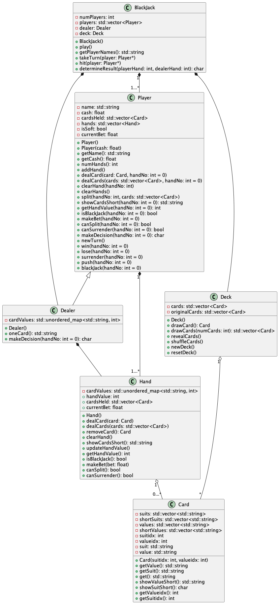

# Blackjack Game in C++

## Overview

This C++ code implements a simple console-based Blackjack (21) game. The game is structured with classes representing key entities like `BlackJack`, `Player`, `Dealer`, `Hand`, `Deck`, and `Card`. Players can place bets, receive cards, make decisions like hit, stand, double down, split, and the game is designed to handle various scenarios like winning, losing, pushing, and Blackjack.

## Class diagram



## How to Run

Compile the C++ code using a C++ compiler. For example:

```bash
clang++ -std=c++17 -stdlib=libc++ -g *.cpp -o output.out
```
